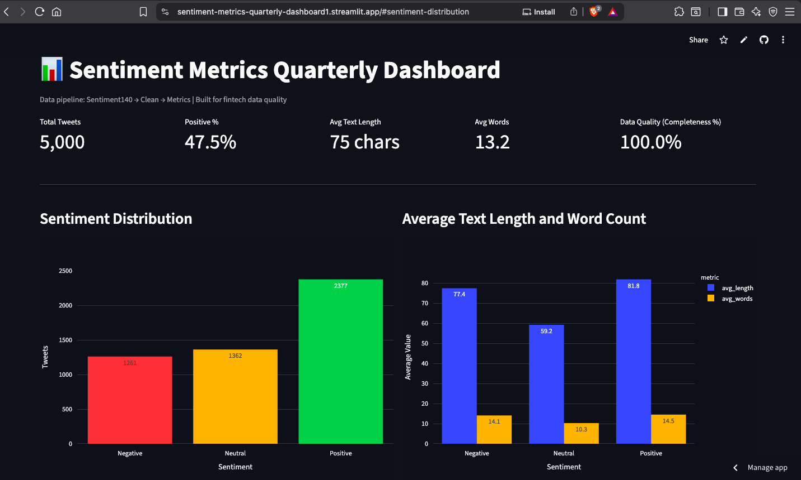
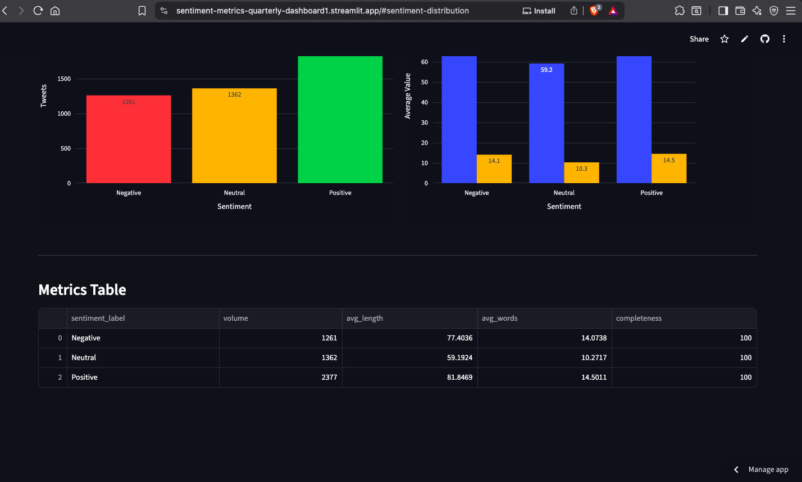

# Sentiment Metrics Quarterly Dashboard
A lightweight data pipeline for fintech sentiment analysis. Built to process the Sentiment140 dataset with production-grade data quality checks.

### Pipeline Steps
- Downloads the Sentiment140 dataset from Kaggle
- Loads a sample of 5,000 rows for a quick demo run
- Removes duplicate rows and rows with missing text
- Adds `sentiment_label`, `text_length`, and `word_count` features
- Aggregates sentiment metrics for reporting
- Exports `clean_sentiment.csv` and `metrics.csv`

### Why This Matters for Fintech
- **Data Quality**: Completeness % + validation checks mirror transaction data QC at scale
- **Scalability**: kagglehub download avoids storing 800MB+ raw data - same pattern used for live transaction feeds

### Dashboard
View the live dashboard here: https://sentiment-metrics-quarterly-dashboard1.streamlit.app/#sentiment-distribution

#### Screenshots

1. Overview / KPIs



2. Charts / metrics



### Requirements


- Python 3.10 or newer
- `pandas`
- `kagglehub`


Install with:

```bash
pip install pandas kagglehub
```

*Usage*

```bash
python 1_data_cleaning.py
```

The script downloads the dataset, cleans data, and prints completeness % + sentiment summary.

*Output Files*
- `clean_sentiment.csv`: cleaned row-level data (local only, not tracked)
- `metrics.csv`: grouped sentiment metrics for dashboard

*Notes*
- Raw `clean_sentiment.csv` is excluded via `.gitignore` to keep repo <100MB
- `metrics.csv` is the tracked output for dashboard viz
- To change sample size, update `nrows=5000` in `1_data_cleaning.py`
